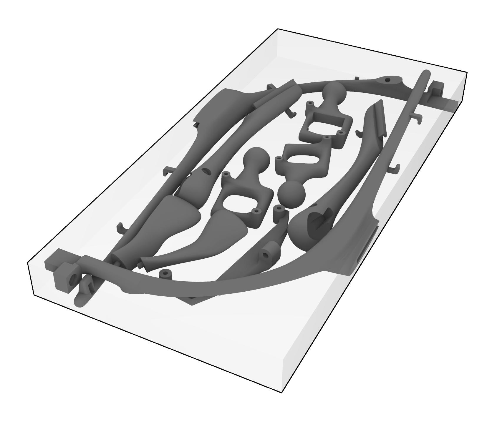

# EyetrackingHeadset-Pupil3D-Expanded

Open-source repository containing 3D models and code for an extended version of the Pupil Labs headset, compatible with various platforms including TouchDesigner.

## Table of Contents
- [Getting Started](#getting-started)
- [3D Model Files](#3d-model-files)
- [Code](#code)
- [License](#license)
- [Acknowledgements](#acknowledgements)

## Getting Started

These instructions will get you a copy of the project up and running on your local machine for development and testing purposes.

### Prerequisites

To get started with this project, you'll need the following installed on your system:

1. Git: for cloning the repository.
2. TouchDesigner or Grasshoper and Rhino: for running the code.

You can download these from their respective websites.

### Installation

To install this project, follow the steps below:

1. Clone the repo: `git clone https://github.com/Awangardajazz/EyetrackingHeadset-Pupil3D-expanded.git`
2. Follow detailed steps as outlined in `https://github.com/pupil-labs/pupil`
3. Download the .TD file

## 3D Model Files

In the `3D_Models` directory, you'll find all the necessary files for 3D printing the Pupil Labs headset. To view, modify or assemble the model use `Eyetracking-Headset-Model3D.3dm` to print use the `Eyetracking-Headset-Model3D-SLS-print.3dm` file located in the `3D_Models` directory. The geometry prepared for SLS 3D printing is enclosed by bounding box for +/- 249 cubic centimeters, making the print  affordable.

The printed elements are shown for reference:

Metal inserts placement:

## Code

In the `Code` directory, you'll find scripts for running the headset on the TouchDesigner platform. To execute the scripts, follow the instructions in the open `Eyetracking-Touchdesigner-Example.td` file located in the `Code` directory and follow instruction inside.

## License

All models and code created by the author is open for use in compliance with the [GNU Lesser General Public License (LGPL v3.0)](http://www.gnu.org/licenses/lgpl-3.0.en.html). The very purpose of this project is to make the eyetracking technology more accessible. Make sure you share your work with the community!

## Acknowledgements

This work builds upon the research and codebase developed by Pupil Labs. I'd like to express my gratitude to them for making their work accessible under the GNU license, allowing contributions like this project to be possible.

---

Please feel free to submit issues and pull requests. All contributions to this repository are appreciated.

---
## Authors
* [Wojciech Karnowka](https://github.com/Awangardajazz)
